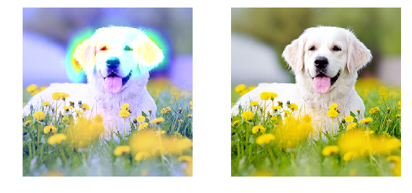
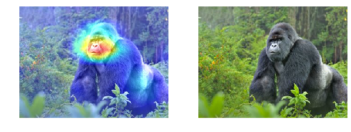
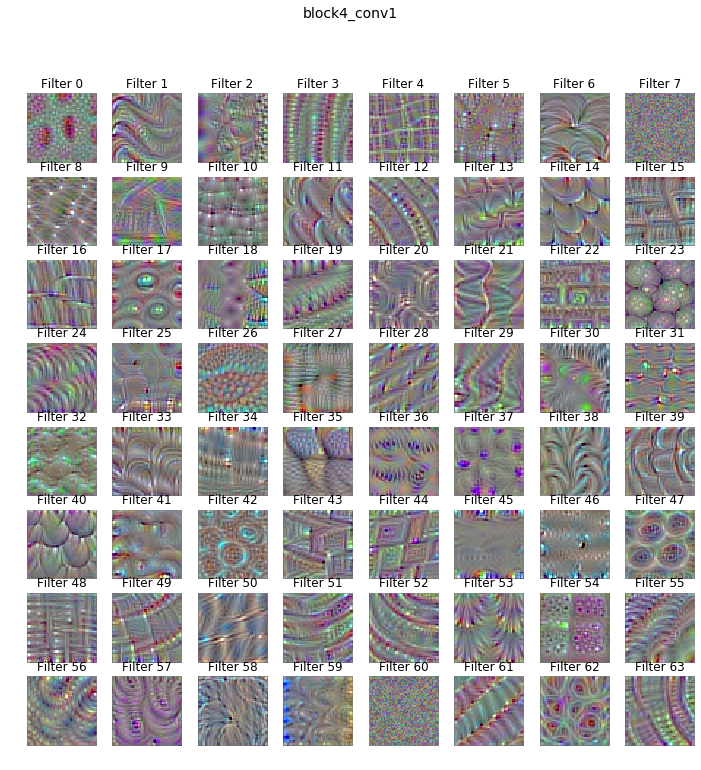

# Visualizing what convnets learn

This repository presents three visualization methods of representations learned 
by convnets.

<ul>
    <li>Visualizing convnets intermediate activations</li>
    <li>Visualizing convnets filters</li>
    <li>Visualizing heatmaps of class activation in an image</li>
</ul>
Those examples come from the great book of François Chollet : Deep learning with
python. I higly recommand it, this is a very good introduction to deep learning
fundamentals with a lot of detailled pratice examples.

<h2>Dependencies</h2>
<ul>
    <li>Keras</li>
    <li>Tensorflow</li>
    <li>OpenCV</li>
    <li>Numpy</li>
    <li>Matplotlib</li>
    <li>Pillow</li>
    
</ul>
<p>
    Install dependencies :

```
pip install -r requirements.txt
```

</p>

<p>
    <h2>Heatmaps of class activation</h2>
    This method helps to determine which parts of an image impacts the most the 
    final classification decision of the convnet. It's based on the Grad-CAM 
    algorithm. This method consists in weighing every channel in the output 
    feature map of a convolution layer by the gradient of the class.
</p>
<p>
    <h5>Classify as Golden-retriever with 97,49 % of accuracy</h5>
    
    <h5>Classify as Gorilla with 99,90% of accuracy</h5>
    
</p>
<p>
    <h2>Convnets filters</h2>
    This method is used to display the visual pattern that each filter is meant
    to respond to. The process is as follows:
    <ul>
        <li>Build a loss function maximizing the value of a given filter</li>
        <li>Use stochastic gradient descent to adjust the input's values 
            maximizing this activation value</li>
    </ul>
    This is useful to understand how convnets works. Each layer learns a bank of
    filters used in combination to express their input. All the layers encode 
    things such as edges, colors, textures. Filters of the higher layers are 
    getting more and more complex. 
</p>

<p>
    <h5>
        The following example shows the 64 first filter's pattern of 
        block4_conv1
    </h5>
    
</p>

<p>
    <h2>Convnets intermediate activations</h2>
    To do

</p>

<p>
    <h3>Source</h3>
    <ul>
        <li>François Chollet : Deep learning with python</li>
    </ul>
</p>
